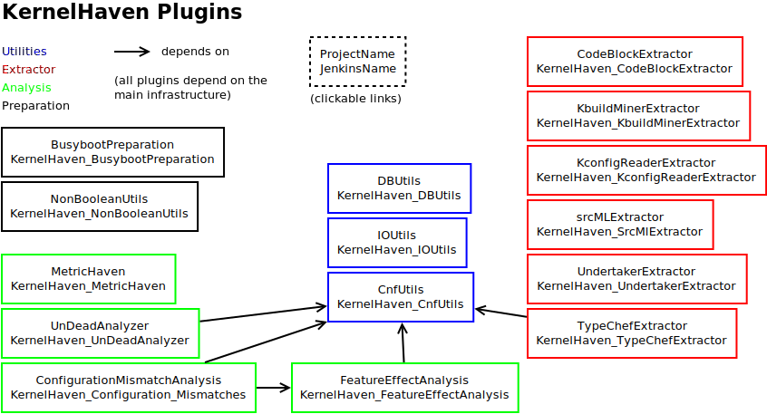

# KernelHaven


KernelHaven offers a generic infrastructure for performing different analyses on product lines. This repository contains the main infrastructure, plugins are located in separate repositories.

## Downloads

### Core Infrastructure

These archives contain the core infrastructure only. Additional [plugins](#plugins) are needed for a useful execution.

* [KernelHaven infrastructure (without sources)](https://jenkins-2.sse.uni-hildesheim.de/job/KH_KernelHaven/lastSuccessfulBuild/artifact/build/jar/KernelHaven.jar)
* [KernelHaven infrastructure (sources included)](https://jenkins-2.sse.uni-hildesheim.de/job/KH_KernelHaven/lastSuccessfulBuild/artifact/build/jar/KernelHaven_withsource.jar)

### Bundled Releases

These archives contain the infrastructure as well as all public [plugins](#plugins). These bundles contain more than needed to run most experiments.

* [KernelHaven plus all plugins (GPLv3 and Apache License 2.0)](https://jenkins-2.sse.uni-hildesheim.de/view/KernelHaven/job/KH_Public_Releases/lastSuccessfulBuild/artifact/build/KernelHaven_GPLv3_withsource.zip)
* [KernelHaven plus only plugins available under the Apache License 2.0](https://jenkins-2.sse.uni-hildesheim.de/view/KernelHaven/job/KH_Public_Releases/lastSuccessfulBuild/artifact/build/KernelHaven_Apache-2.0_withsource.zip)

## Plugins

The following table lists commonly used plugins for KernelHaven. They mostly focus on analysing the Linux Kernel.
<table style="width:100%">
  <tr>
    <th>Plugin</th>
    <th>Type</th>
    <th>License</th>
    <th>Download</th>
    <th>Status</th>
  </tr>
  <!-- KconfigReaderExtractor -->
  <tr>
    <td><a href="https://github.com/KernelHaven/KconfigReaderExtractor">KconfigReaderExtractor</a></td>
    <td><b>VariabilityModel-Extractor:</b> Kconfig</td>
    <td><a href="https://www.gnu.org/licenses/gpl-3.0.html">GPLv3</a></td>
    <td><ul>
      <li><a href="https://jenkins-2.sse.uni-hildesheim.de/job/KH_KconfigReaderExtractor/lastSuccessfulBuild/artifact/build/jar/KconfigReaderExtractor.jar">JAR</a></li>
      <li><a href="https://jenkins-2.sse.uni-hildesheim.de/job/KH_KconfigReaderExtractor/lastSuccessfulBuild/artifact/build/jar/KconfigReaderExtractor_withsource.jar">JAR with sources</a></li>
    </ul></td>
    <td></td>
  </tr>
  <!-- UndertakerExtractor -->
  <tr>
    <td><a href="https://github.com/KernelHaven/UndertakerExtractor">UndertakerExtractor</a></td>
    <td><b>CodeModel-Extractor:</b> <code>*.c, *.h, *.S</code></td>
    <td><a href="https://www.gnu.org/licenses/gpl-3.0.html">GPLv3</a></td>
    <td><ul>
      <li><a href="https://jenkins-2.sse.uni-hildesheim.de/job/KH_UndertakerExtractor/lastSuccessfulBuild/artifact/build/jar/UndertakerExtractor.jar">JAR</a></li>
      <li><a href="https://jenkins-2.sse.uni-hildesheim.de/job/KH_UndertakerExtractor/lastSuccessfulBuild/artifact/build/jar/UndertakerExtractor_withsource.jar">JAR with sources</a></li>
    </ul></td>
    <td></td>
  </tr>
  <!-- TypeChefExtractor -->
  <tr>
    <td><a href="https://github.com/KernelHaven/TypeChefExtractor">TypeChefExtractor</a></td>
    <td><b>CodeModel-Extractor:</b> <code>*.c, *.h</code></td>
    <td><a href="https://www.apache.org/licenses/LICENSE-2.0.html">Apache License 2.0</a></td>
    <td><ul>
      <li><a href="https://jenkins-2.sse.uni-hildesheim.de/job/KH_TypeChefExtractor/lastSuccessfulBuild/artifact/build/jar/TypeChefExtractor.jar">JAR</a></li>
      <li><a href="https://jenkins-2.sse.uni-hildesheim.de/job/KH_TypeChefExtractor/lastSuccessfulBuild/artifact/build/jar/TypeChefExtractor_withsource.jar">JAR with sources</a></li>
    </ul></td>
    <td></td>
  </tr>
  <!-- srcMLExtractor -->
  <tr>
    <td><a href="https://github.com/KernelHaven/srcMLExtractor">srcMLExtractor</a></td>
    <td><b>CodeModel-Extractor:</b> <code>*.c</code></td>
    <td><a href="https://www.gnu.org/licenses/gpl-3.0.html">GPLv3</a></td>
    <td><ul>
      <li><a href="https://jenkins-2.sse.uni-hildesheim.de/job/KH_SrcMlExtractor/lastSuccessfulBuild/artifact/build/jar/SrcMLExtractor.jar">JAR</a></li>
      <li><a href="https://jenkins-2.sse.uni-hildesheim.de/job/KH_SrcMlExtractor/lastSuccessfulBuild/artifact/build/jar/SrcMLExtractor_withsource.jar">JAR with sources</a></li>
    </ul></td>
    <td></td>
  </tr>
  <!-- KbuildMinerExtractor -->
  <tr>
    <td><a href="https://github.com/KernelHaven/KbuildMinerExtractor">KbuildMinerExtractor</a></td>
    <td><b>BuildModel-Extractor:</b> <code>Kbuild*, Makefile*</code></td>
    <td><a href="https://www.gnu.org/licenses/gpl-3.0.html">GPLv3</a></td>
    <td><ul>
      <li><a href="https://jenkins-2.sse.uni-hildesheim.de/job/KH_KbuildMinerExtractor/lastSuccessfulBuild/artifact/build/jar/KbuildminerExtractor.jar">JAR</a></li>
      <li><a href="https://jenkins-2.sse.uni-hildesheim.de/job/KH_KbuildMinerExtractor/lastSuccessfulBuild/artifact/build/jar/KbuildminerExtractor_withsource.jar">JAR with sources</a></li>
    </ul></td>
    <td></td>
  </tr>
  <!-- CnfUtils -->
  <tr>
    <td><a href="https://github.com/KernelHaven/CnfUtils">CnfUtils</a></td>
    <td><b>Utilities:</b> SAT-Solver, CNF-Converter, Formula simplifiers, ...</td>
    <td><a href="https://www.apache.org/licenses/LICENSE-2.0.html">Apache License 2.0</a></td>
    <td><ul>
      <li><a href="https://jenkins-2.sse.uni-hildesheim.de/job/KH_CnfUtils/lastSuccessfulBuild/artifact/build/jar/CnfUtils.jar">JAR</a></li>
      <li><a href="https://jenkins-2.sse.uni-hildesheim.de/job/KH_CnfUtils/lastSuccessfulBuild/artifact/build/jar/CnfUtils_withsource.jar">JAR with sources</a></li>
    </ul></td>
    <td></td>
  </tr>
  <!-- IOUtils -->
  <tr>
    <td><a href="https://github.com/KernelHaven/IOUtils">IOUtils</a></td>
    <td><b>Utilities:</b> Excel-readers and writers for extractors and analysis plugins</td>
    <td><a href="https://www.apache.org/licenses/LICENSE-2.0.html">Apache License 2.0</a></td>
    <td><ul>
      <li><a href="https://jenkins-2.sse.uni-hildesheim.de/job/KH_IOUtils/lastSuccessfulBuild/artifact/build/jar/IOUtils.jar">JAR</a></li>
      <li><a href="https://jenkins-2.sse.uni-hildesheim.de/job/KH_IOUtils/lastSuccessfulBuild/artifact/build/jar/IOUtils_withsource.jar">JAR with sources</a></li>
    </ul></td>
    <td></td>
  </tr>
  <!-- NonBooleanUtils -->
  <tr>
    <td><a href="https://github.com/KernelHaven/NonBooleanUtils">NonBooleanUtils</a></td>
    <td><b>Utilities:</b> Utilities to handle models, which are not pure Boolean (Pseudo-SAT)</td>
    <td><a href="https://www.apache.org/licenses/LICENSE-2.0.html">Apache License 2.0</a></td>
    <td><ul>
      <li><a href="https://jenkins-2.sse.uni-hildesheim.de/job/KH_NonBooleanUtils/lastSuccessfulBuild/artifact/build/jar/NonBooleanUtils.jar">JAR</a></li>
      <li><a href="https://jenkins-2.sse.uni-hildesheim.de/job/KH_NonBooleanUtils/lastSuccessfulBuild/artifact/build/jar/NonBooleanUtils_withsource.jar">JAR with sources</a></li>
    </ul></td>
    <td></td>
  </tr>
  <!-- UnDeadAnalyzer -->
  <tr>
    <td><a href="https://github.com/KernelHaven/UnDeadAnalyzer">UnDeadAnalyzer</a></td>
    <td><b>Analysis:</b> Detection of dead code and unused variables of the variability model</td>
    <td><a href="https://www.apache.org/licenses/LICENSE-2.0.html">Apache License 2.0</a></td>
    <td><ul>
      <li><a href="https://jenkins-2.sse.uni-hildesheim.de/job/KH_UnDeadAnalyzer/lastSuccessfulBuild/artifact/build/jar/UnDeadAnalyzer.jar">JAR</a></li>
      <li><a href="https://jenkins-2.sse.uni-hildesheim.de/job/KH_UnDeadAnalyzer/lastSuccessfulBuild/artifact/build/jar/UnDeadAnalyzer_withsource.jar">JAR with sources</a></li>
    </ul></td>
    <td></td>
  </tr>
  <!-- FeatureEffectAnalyzer -->
  <tr>
    <td><a href="https://github.com/KernelHaven/FeatureEffectAnalysis">FeatureEffectAnalyzer</a></td>
    <td><b>Analysis:</b> Detection of presence conditions and feature effects</td>
    <td><a href="https://www.apache.org/licenses/LICENSE-2.0.html">Apache License 2.0</a></td>
    <td><ul>
      <li><a href="https://jenkins-2.sse.uni-hildesheim.de/view/KernelHaven/job/KH_FeatureEffectAnalysis/lastSuccessfulBuild/artifact/build/jar/FeatureEffectAnalysis.jar">JAR</a></li>
      <li><a href="https://jenkins-2.sse.uni-hildesheim.de/view/KernelHaven/job/KH_FeatureEffectAnalysis/lastSuccessfulBuild/artifact/build/jar/FeatureEffectAnalysis_withsource.jar">JAR with sources</a></li>
    </ul></td>
    <td></td>
  </tr>
  <!-- MetricHaven -->
  <tr>
    <td><a href="https://github.com/KernelHaven/MetricHaven">MetricHaven</a></td>
    <td><b>Analysis:</b> Metric Infrastructure for SPL-Metrics</td>
    <td><a href="https://www.apache.org/licenses/LICENSE-2.0.html">Apache License 2.0</a></td>
    <td><ul>
      <li><a href="https://jenkins-2.sse.uni-hildesheim.de/job/KH_MetricHaven/lastSuccessfulBuild/artifact/build/jar/MetricHaven.jar">JAR</a></li>
      <li><a href="https://jenkins-2.sse.uni-hildesheim.de/job/KH_MetricHaven/lastSuccessfulBuild/artifact/build/jar/MetricHaven_withsource.jar">JAR with sources</a></li>
    </ul></td>
    <td></td>
  </tr>
  <!-- Configuration Mismatches -->
  <tr>
    <td><a href="https://github.com/KernelHaven/ConfigurationMismatchAnalysis">Configuration Mismatches</a></td>
    <td><b>Analysis:</b> Detection of Configuration Mismatches</td>
    <td><a href="https://www.apache.org/licenses/LICENSE-2.0.html">Apache License 2.0</a></td>
    <td><ul>
      <li><a href="https://jenkins-2.sse.uni-hildesheim.de/job/KH_Configuration_Mismatches/lastSuccessfulBuild/artifact/build/jar/ConfigurationMismatchAnalysis.jar">JAR</a></li>
      <li><a href="https://jenkins-2.sse.uni-hildesheim.de/job/KH_Configuration_Mismatches/lastSuccessfulBuild/artifact/build/jar/ConfigurationMismatchAnalysis_withsource.jar">JAR with sources</a></li>
    </ul></td>
    <td></td>
  </tr>
  <!-- Problem-Solution-Space Mapper -->
  <tr>
    <td><a href="https://github.com/KernelHaven/ProblemSolutionSpaceMapperAnalysis">Problem-Solution-Space Mapper</a></td>
    <td><b>Analysis:</b> Identification of relations between problem and solution space artifacts</td>
    <td><a href="https://www.apache.org/licenses/LICENSE-2.0.html">Apache License 2.0</a></td>
    <td><ul>
      <li><a href="https://jenkins-2.sse.uni-hildesheim.de/view/KernelHaven/job/KH_ProblemSolutionSpaceMapperAnalysis/lastSuccessfulBuild/artifact/build/jar/ProblemSolutionSpaceMapperAnalysis.jar">JAR</a></li>
      <li><a href="https://jenkins-2.sse.uni-hildesheim.de/view/KernelHaven/job/KH_ProblemSolutionSpaceMapperAnalysis/lastSuccessfulBuild/artifact/build/jar/ProblemSolutionSpaceMapperAnalysis_withsource.jar">JAR with sources</a></li>
    </ul></td>
    <td></td>
  </tr>
</table>

The following image visualizes the dependencies between the plugins (open image in a new browser tab to make plugin links clickable):



## Setup

Although KernelHaven can be configured to use different paths, the usual setup looks like this:

```
kernel_haven/
├── cache/
│   └── ...
├── log/
│   └── ...
├── output/
│   └── ...
├── plugins/
│   ├── cnfutils.jar
│   ├── kbuildminerextractor.jar
│   ├── kconfigreaderextractor.jar
│   ├── undeadanalyzer.jar
│   └── undertakerextractor.jar
├── res/
│   └── ...
├── kernel_haven.jar
└── dead_code.properties
```

A configuration to execute a dead code analysis on Linux with this setup looks like this:

```Properties
# Linux Source Tree
source_tree = /path/to/linux-4.4
arch = x86

# Analysis
analysis.class = net.ssehub.kernel_haven.undead_analyzer.DeadCodeAnalysis

# Code Extractor
code.provider.cache.read = true
code.provider.cache.write = true
code.extractor.class = net.ssehub.kernel_haven.undertaker.UndertakerExtractor
code.extractor.threads = 4

# Build Extractor
build.provider.cache.read = true
build.provider.cache.write = true
build.extractor.class = net.ssehub.kernel_haven.kbuildminer.KbuildMinerExtractor

# Variability Extractor
variability.provider.cache.read = true
variability.provider.cache.write = true
variability.extractor.class = net.ssehub.kernel_haven.kconfigreader.KconfigReaderExtractor

# Logging
log.console = true
log.file = true

# Directories
archive.dir = .
cache_dir = cache/
log.dir = log/
output_dir = output/
plugins_dir = plugins/
resource_dir = res/
```

See [`config_template.properties`](config_template.properties) for a full list of available configuration options for the infrastructure and common plugins.

## Further Documentation

Further documentation can be found in the [wiki on GitHub](https://github.com/KernelHaven/KernelHaven/wiki). A pdf version can be downloaded from [here](https://jenkins-2.sse.uni-hildesheim.de/view/KernelHaven/job/KH_Documentation/lastSuccessfulBuild/artifact/Manual.pdf).

## Video Tutorials

#### Introduction and Experiments
[](https://youtu.be/xKde6tPY_jA)

#### ICSE 2018 Demonstration
[](https://www.youtube.com/watch?v=IbNc-H1NoZU)

## License

The main infrastructure (this project) is licensed under the [Apache License 2.0](https://www.apache.org/licenses/LICENSE-2.0.html). Plugins may have different licenses.

## Acknowledgments

This work is partially supported by the ITEA3 project [REVaMP<sup>2</sup>](https://itea3.org/project/revamp2.html), funded by the BMBF (German Ministry of Research and Education) under grant 01IS16042H.

We would like to thank the following persons, who contributed to the initial version of KernelHaven: [Moritz Flöter](https://www.moritzf.de/), Adam Krafczyk, Alice Schwarz, Kevin Stahr, Johannes Ude, Manuel Nedde, Malek Boukhari, and Marvin Forstreuter.
